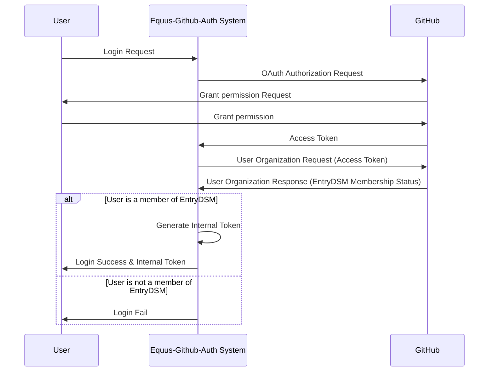

# Service Relationship Diagram

```mermaid
sequenceDiagram
    participant User as User
    participant App as Equus-Github-Auth System
    participant GitHub as GitHub

    User ->> App: Login Request
    App ->> GitHub: OAuth Authorization Request
    GitHub ->> User: Grant permission Request
    User ->> GitHub: Grant permission
    GitHub ->> App: Access Token

    App ->> GitHub: User Organization Request (Access Token)
    GitHub ->> App: User Organization Response (EntryDSM Membership Status)

    alt User is a member of EntryDSM
        App ->> App: Generate Internal Token
        App ->> User: Login Success & Internal Token
    else User is not a member of EntryDSM
        App ->> User: Login Fail
    end
```

