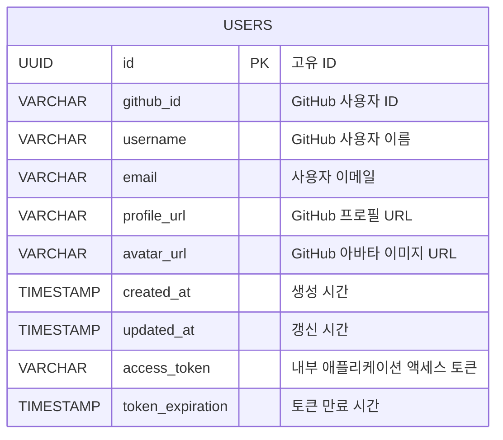

# Scheme

```mermaid
erDiagram
    USERS {
        UUID id PK "고유 ID"
        VARCHAR github_id "GitHub 사용자 ID"
        VARCHAR username "GitHub 사용자 이름"
        VARCHAR email "사용자 이메일"
        VARCHAR profile_url "GitHub 프로필 URL"
        VARCHAR avatar_url "GitHub 아바타 이미지 URL"
        TIMESTAMP created_at "생성 시간"
        TIMESTAMP updated_at "갱신 시간"
        VARCHAR access_token "내부 애플리케이션 액세스 토큰"
        TIMESTAMP token_expiration "토큰 만료 시간"
    }
```